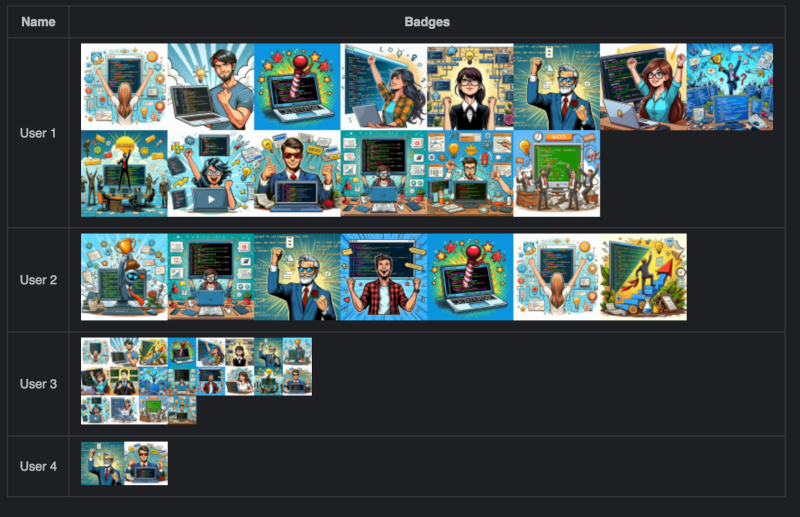
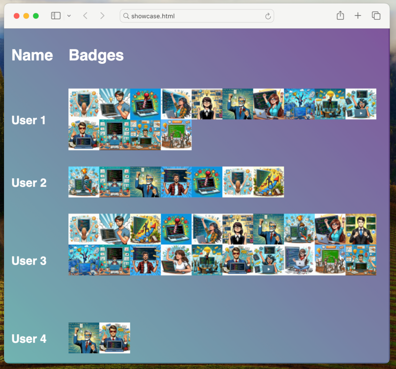

# Badger
a simple rest api that supports only this one get request type, it returns a png consisting of every badge associated to the given userid.
it could be used to keep track of events a group of persons participated or things that got accomplished. the resulting png can then be added to a page where these badges can be viewed.

```http://localhost:8080/api/badges/user4/48/8/badges.png```

| URL Parameter | Usage                                                                             |
|---------------|-----------------------------------------------------------------------------------|
| user4         | a user present in the database, all badges associated to the user will be loaded |
| 48            | the width and height a single badge will have in the returned png                 |
| 8             | number of badges in a row                                                         |

the url of the service can be used like any image you would reference.

Example 1: referenced in a [markdown file](src/test/showcase.md).


Example 2: referenced in a [html file](src/test/showcase.html).

